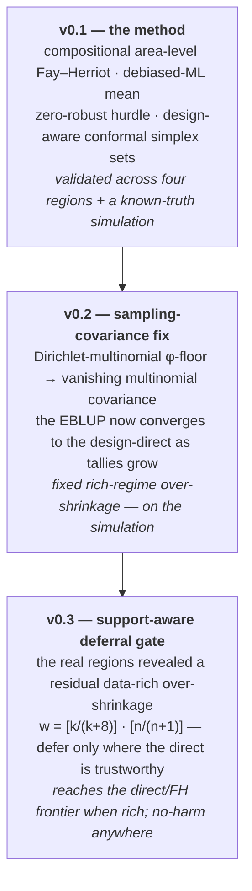

<p align="center">
  
</p>

<p align="center">
  <b>CO</b>mpositional <b>N</b>onlinear-debiased <b>I</b>nference, <b>F</b>ay–Herriot with <b>E</b>llipsoidal conformal <b>R</b>egions<br>
  <em>Robust. Compositional. Confident.</em>
</p>

<p align="center">
  <a href="https://pypi.org/project/conifer-sae/"></a>
  
  <a href="https://github.com/IFC-UIDAHO/conifer/blob/main/LICENSE"></a>
  <a href="https://github.com/IFC-UIDAHO/conifer/actions/workflows/tests.yml"></a>
  <a href="https://github.com/psf/black"></a>
</p>

> ⚠️ **Preview Release** — CONIFER is under active development. APIs may change before the first stable 1.0.
> This README describes the **current release (v0.3)**; earlier versions and their results are in the git history.

Design-aware small-area estimation of forest structure as *distributions*, not just totals. CONIFER
estimates the **diameter distribution** — stem density split across DBH classes — for small forest
areas where the field sample is too thin for a reliable direct estimate, and attaches an honest,
*checked* statement of uncertainty.

> **In a nutshell.** You have a cruise — a few stands measured well, many with just a
> plot or two, some not at all. CONIFER returns the **stems per acre in each diameter class for every
> stand**, including the thin ones, each with an uncertainty range you can defend to whoever paid for the
> inventory. It borrows strength from your LiDAR/aerial metrics and from comparable stands, and it tells
> you *per stand* how much of the answer came from that stand's own plots versus the model. No statistics
> background needed: `pip install "conifer-sae[app]"` then `conifer-studio`, or press **Load the demo
> cruise** and click through. Full‑code and no‑code paths give the same estimator.

<p align="center">
  <a href="https://youtu.be/IR-qZSbJnhM" title="Watch the 60-second, zero-code tour">
    
  </a>
  <br>
  <em>▶ <a href="https://youtu.be/IR-qZSbJnhM">Watch the 60-second, zero-code tour</a> — from <code>pip install</code> to a checked stand report, no code.</em>
</p>

For a stand *i* the target is the whole stand table `s_i = N_i · p_i`: a **total** density `N_i`
(stems per acre) times a **composition** `p_i` — the shares across DBH classes, a point on the simplex.
That is three hard problems at once, and no prior small-area method handles them together:

- the response is **compositional** (shares that sum to one, with a nonlinear link to canopy structure),
- the large-diameter tail is **structurally zero** (many stands genuinely tally *nothing* above 15–20″), and
- the stands you care about are **data-poor** (a handful of plots, sometimes none).

Under the hood CONIFER is a **compositional area-level Fay–Herriot** estimator with a cross-fitted,
one-step-**debiased machine-learned mean**, a **zero-robust hurdle** for the empty tail, an analytic
**design-based sampling covariance**, **design-aware conformal prediction sets on the simplex**, and — new
in v0.3 — a **support-aware reduce-to-direct deferral gate** that hands accuracy back to the design-direct
exactly where it becomes reliable. It **reduces exactly to classical Fay–Herriot** when the mean is linear
(verified ratio 1.0002), so the familiar estimator is a special case, not a competitor.

```bash
pip install conifer-sae
```

## How CONIFER evolved — v0.1 → v0.2 → v0.3

Each release fixed one honest, *measured* failure mode. The method never changed shape; it got more
correct in the regime where it was weakest.



| Version | What changed | Impact (measured) |
|---|---|---|
| **v0.1** | The method: compositional FH, cross-fitted debiased-ML mean, zero-robust hurdle, conformal simplex sets. | Established the estimator; won the data-poor regime and the competitor shootout across four regions. |
| **v0.2** | Replaced the Dirichlet-multinomial φ-floor with a **vanishing multinomial** sampling covariance. | The EBLUP provably converges to the design-direct as tallies accumulate — removed the rich-regime over-shrinkage **the simulation** surfaced. |
| **v0.3** | Added the **support-aware reduce-to-direct deferral gate** (`defer_c=8`, `defer_a=1`), and a fair head-to-head vs published area-level SAE. | Closes the residual data-rich over-shrinkage on the **real** regions — Mississippi **0.275 → 0.260**, Arkansas **0.461 → 0.363**, South Carolina **0.608 → 0.600** — reaching the direct / mature-FH frontier while preserving the data-poor win. Default `fit()` is byte-identical to v0.2. |

## Start from your cruise data

You have a tree list and, ideally, stand-level remote-sensing metrics. That is all CONIFER needs.

```python
import conifer

inv = conifer.from_treelist(
    trees,                       # one row per tallied tree
    stand_col="STAND", plot_col="PLOT", dbh_col="DBH_IN",
    plot_area=0.2,               # fixed-area cruise; use baf=20 for a prism cruise
    aux=stand_metrics,           # LiDAR / spectral / terrain, one row per stand
    aux_stand_col="STAND",
)
print(inv.describe())            # what CONIFER sees
print(inv.issue_table())         # problems, in language you can act on

est = inv.fit()

# prediction intervals, calibrated from your own plots — no known truth needed
lo, hi = conifer.calibration.calibrated_intervals(est, alpha=0.10)
print(est.interval_report_.summary)

cov = conifer.coverage_check(est)                 # and check that they actually hold up
print(cov.summary)
# "Across 10 independent splits, the 90% interval for a given diameter class contained
#  the held-out field value 91% of the time. That meets the stated level."

conifer.report.to_html(est, "stand_report.html", coverage=cov)
conifer.report.to_excel(est, "results.xlsx")
```

`from_treelist` bins DBH, derives effective area, and wires the **correct sampling covariance for your
plot design** — a prism cruise gets a design-based covariance built from the plot replicates, because the
multinomial assumption behind the analytic one does not hold when each tree carries a DBH-dependent
expansion factor. Stand identifiers are carried through every table, figure and export, so a mis-sorted
input can no longer silently corrupt the estimate.

Metric units, FIA 1″/2″ class breaks, stand polygons in and out (`read_stands`, `attach_estimates`), and a
`min_dbh` merchantability threshold are all supported.

## No code at all

```bash
pip install "conifer-sae[app]"
conifer-studio
```

If your shell reports `conifer-studio: command not found` (common on Windows, where pip's scripts folder is
often not on `PATH`), this does the same thing and never depends on `PATH`:

```bash
python -m conifer.studio
```

Upload a tree list — or press **Load the demo cruise** — and get stand tables, maps, an Excel workbook and a
printable stand report, with a per-stand *"% from your own plots"* readout so you can see how far each
estimate was borrowed. Everything runs on the machine you start it on, so proprietary inventory never leaves
your network. See [`apps/forester/`](https://github.com/IFC-UIDAHO/conifer/tree/main/apps/forester).

## Validated across four regions and a simulation

CONIFER was not tuned on one dataset. The full pipeline was developed on the Idaho origin region and then
**independently replicated, refit from scratch, on three Southeastern ownerships** — a deliberate test of
whether it generalizes rather than overfits where it was born. A design-based Monte-Carlo simulation with a
*known truth* backs the empirical ordering and hardened the estimator.

| Region | Forest type | Stands | Data-poor: CONIFER vs direct | Notes |
|---|---|---|---|---|
| **St. Joe, Idaho** (origin) | Inland-NW mixed conifer | 375 | **+18%** better than direct | 3D-NAIP, FIA-coherent, external transfer test |
| **Arkansas** (AOI1) | Loblolly pine plantation | 449 | **+14%** better than direct | wins the competitor shootout; motivated the v0.3 gate |
| **Mississippi** (AOI3) | Loblolly pine plantation | 46 | wins sparse; ties direct when plot-rich | the *honest counter-case*; data-rich gap closed in v0.3 |
| **South Carolina** (AOI2) | Loblolly pine plantation | 33 | **+18%** better than direct | degenerate tail crashed three competitors; CONIFER ran on all |

### The fair head-to-head, and the data-rich regime (v0.3)

Beyond the "% better than direct" summary, each Southern region was run as a **fair head-to-head** against
published area-level SAE competitors — the multivariate Fay–Herriot of `msae`, the compositional `sae.prop`
/ Esteban family, and a tri-compositional FH — on *identical* inputs (same subsample, covariates, truth),
scored as log-density RMSE against the full-cruise held-out truth. Two regimes tell different stories.

In the **data-poor** regime (2–4 plots per stand) CONIFER beats the design-direct by a wide margin — the
small-area use case:

| Region · data-poor | CONIFER | design-direct | best competitor FH |
|---|---|---|---|
| Mississippi | **0.559** | 0.729 | 0.617 |
| Arkansas | **0.765** | 1.069 | 0.897 |
| South Carolina | **0.915** | 1.361 | 0.800 |

In the **data-rich** regime the design-direct and the mature FH become reliable, and v0.2 over-shrank
against them. The **v0.3 support-aware gate closes that gap to the frontier** without touching the data-poor
win:

| Region · data-rich | CONIFER v0.2 | **CONIFER v0.3** | design-direct | best competitor FH |
|---|---|---|---|---|
| Mississippi | 0.275 | **0.260** | 0.227 | 0.233 |
| Arkansas | 0.461 | **0.363** | 0.344 | 0.325 |
| South Carolina | 0.608 | **0.600** | 0.794 | 0.653 |

*(log-density RMSE vs held-out truth; lower is better.)* The gate is a single global rule,
`w_ik = [k_i/(k_i+8)] · [n_ik/(n_ik+1)]` — a **data-adequacy** factor (defer more as plot support *k* grows)
times an **add-one support prior** (defer a class only where the direct has real tally). South Carolina is
the discriminating case: its structural-zero tail makes the raw direct unreliable *even when rich* (0.794),
so the support prior keeps the hurdle there, where a plot-count-only gate would over-defer. The gate is
validated **no-harm on both the held-out simulation** (it improves at every plot count) **and all three real
regions**, and it needs plot-level input — where plots are absent it reduces exactly to v0.2.

**St. Joe, Idaho — the origin study.** ~50,000 trees on 375 industrial stands, wall-to-wall 3D-NAIP canopy
metrics, benchmarked against design-based FIA. In the sparse regime (1–2 plots per stand) CONIFER cuts
log-density RMSE from the direct estimator's **1.517 to 1.239 (+18%,** Holm-corrected p ≈ 0), and for
never-sampled stands from 2.017 to **1.412 (+30%)**. On merchantable stems (≥ 5″) the quadratic-mean-diameter
EBLUP beats direct by **+20%**. It leads a broad competitor slate — kNN, Weibull, MERF, SAEforest, BART-FH, a
Dirichlet-multinomial, a spatial Fay–Herriot, KBAABB, and a multivariate FH on raw densities — and against
that raw multivariate FH the **compositional** treatment is decisive (1.229 vs 1.475, p < 0.001): the simplex
geometry, not just "more covariates," is the source of the gain. The estimate stays coherent with the
design-based FIA totals it rolls up to (461 vs 524 stems/acre, ≥ 2″ composition Aitchison distance 0.36). An
external transfer to Moscow Mountain — a different ownership 50 miles away — is reported honestly as
*moderate* (Hellinger 0.30), the limit a canopy-surface sensor should have.

**The Southeastern regions — a different forest, refit from scratch.** Arkansas (Bradley–Drew, 96% loblolly),
Mississippi (Meridian, mature + young-clearcut loblolly) and South Carolina (Greenwood, young loblolly with a
near-empty large-diameter tail) are FIA-benchmarked loblolly-pine plantations — ecologically the opposite of
Inland-NW conifer. Refit on each, CONIFER **wins or ties the real-competitor shootout**, delivers valid
conformal coverage everywhere (0.90–0.94), and in South Carolina simply **kept running on the degenerate tail
that made BART-FH, hierarchical BART-FH and a Dirichlet-multinomial crash** — "the crashes are the finding."
Mississippi is included precisely because it is the case where the direct estimate is competitive: a small,
plot-rich, homogeneous population where small-area borrowing has little to add, and CONIFER *does not
manufacture an advantage the sample size doesn't support* — and where v0.3 now closes the data-rich gap.

**What is intrinsic vs what you recalibrate.** Across all three Southern regions the single load-bearing
capability is the **zero-robust compositional hurdle** — removing it inflates error by
**+117% / +160% / +308%**, by far the largest effect of any component, and it is *species-agnostic*: exactly
what a degenerate large-diameter tail needs, whether the tail is Idaho conifer or Carolina pine. What must be
**calibrated per region, never transferred**, is the plot-density convention (audited every time). The
earlier per-region adequacy-gate threshold (τ\* = 1 / 3 / 5) is **superseded in v0.3** by the single global
support-aware gate above, which needs no per-region tuning. Bolting on spatial or regeneration structure did
*not* help (neutral to harmful); CONIFER borrows strength through covariates and the gate, not through
region-specific machinery. That is the honest reason the method travels: the transferable core is geometry,
not an Idaho-shaped default model.

**The simulation.** Eleven populations — eight forest archetypes spanning young plantation, mixed conifer,
uneven-aged reverse-J, bimodal and old-growth, plus three *plasmode* populations built from the **real**
Arkansas/Mississippi/South Carolina LiDAR covariate matrices — sampled at 1–25 plots per stand over 200
replicates against a known truth. CONIFER has the lowest log-density RMSE in **all eight archetypes** (by
0.11–0.27), and its conformal joint coverage holds at **0.90–0.91 across every sampling intensity** where the
analytic Gaussian interval collapses on the zero tally tail. The simulation is also where the v0.3 gate was
tuned and stress-tested: `c = 8` (equal model/direct weight at eight plots) was selected on the held-out
plasmode, and the gate improves the estimate at **every** plot count there before it was ever run on the real
regions.

## About the uncertainty

Two things here are worth stating plainly, because both are easy to get wrong.

**Calibration without a known truth.** Conformal prediction needs a calibration set where the truth is known.
A real inventory never has one. Calibrating against the design-direct estimate of the *same* plots looks
reasonable and is **invalid**: CONIFER's estimate is a shrinkage *of* that estimate, so the residual is
mechanically smaller than the true error — measured against a known truth it under-covers (0.68 for a nominal
0.90 set; and a naive Gaussian box under-covers *jointly* at 0.475 against nominal 0.95).
`conformalize_holdout()` instead splits each stand's *plots* in two, fits on one half and calibrates against
the other. Independent by construction, and it errs wide rather than narrow.

**Per-class by default, joint on request.** For any one diameter class you name, the reported interval
contains the truth at the stated rate — the question a forester actually asks, and several times narrower
than a set guaranteed to contain *all* classes at once. Pass `joint=True` for the simultaneous claim; every
table and figure states which of the two it is reporting.

**The set is checked against a known truth, and it holds.** Measured on the St. Joe study, the design-aware
minimum-volume conformal set achieves **joint five-class coverage 0.946 at a nominal 0.95** — versus **0.475**
for a Gaussian box on the same data — and an independent audit reproduced it at 0.944. It is **20% tighter**
than that Gaussian box at matched validity, and the zero-robust log-ratio shrinks it by a further ~80% at
unchanged coverage. Coverage holds *conditionally* too (SD 0.032 across canopy strata), not just on average.
Across the three Southeastern regions the joint conformal coverage is **0.897–0.935** (target 0.90), while the
analytic Gaussian box on a common joint basis collapses to 0.33–0.60 — so the conformal set is *necessary*,
not merely preferable.

**Why conformal, not the analytic MSE.** The analytic (plug-in or double-bootstrap) MSE is honestly
**anti-conservative — it recovers only about half of the empirical error**, most severely for regeneration.
So CONIFER reports the *conformal* set as its operational uncertainty statement, and `coverage_check()`
measures realised coverage on held-out plots and hands it back in a sentence you can put in front of a client.
On the classes anyone acts on, the interval runs about ±90% of the estimate; read the near-empty tail classes
in stems per acre, not percent, where the denominator is near zero and a percentage reads alarmingly and means
little.

## Geographic and forest-type scope

CONIFER carries the University of Idaho / Intermountain Forestry Cooperative provenance, and it is fair to ask
whether it is therefore locked to Pacific/Inland-Northwest conifers. It is not — but the distinction matters:

- **It is a *method* you refit on your own cruise, not a frozen pretrained model.** Every region above was fit
  from scratch on its own field data. There are no Idaho-baked coefficients shipped as a default.
- **The validated envelope** is Inland-Northwest **mixed conifer** *and* Southeastern **loblolly-pine
  plantations** — two very different systems. The capability that carries the method (the zero-robust
  compositional geometry) is species-agnostic.
- **What you recalibrate locally** is the plot-density convention (audited every time) plus the fit itself
  against your plots. The v0.3 deferral gate is global — no per-region threshold to set.
- **What is not yet validated:** **hardwood and mixed-hardwood / bottomland systems.** All Southeastern
  validation is pine plantation; no hardwood field data has been run. Treat hardwood as unproven — not claimed
  to work, not claimed to fail.

In short: the honest warning is "audit your density convention per region," not "this only works on Douglas-fir."

## About the estimator (a little deeper)

- **Debiased-ML mean.** The synthetic mean is a cross-fitted ensemble (random-feature ridge + a
  gradient-boosted residual correction) with a one-step (Riesz) debiasing applied to the out-of-fold mean — the
  discrete analogue of Neyman orthogonality. It shrinks toward the *out-of-fold* mean, which stops a flexible
  learner from quietly leaking the field estimate it is meant to improve on (debiasing lifts first-order
  coverage from 0.835 to 0.910). Honest caveat: the cross-fitted mean buys a *first-order* orthogonal MSE, not
  a genuine second-order expansion.
- **Total × composition.** The total `N_i` (a univariate log-scale FH) and the shares `p_i` (a compositional
  FH in additive-log-ratio space) are estimated as two coupled models and recombined by the delta method, with
  a structural-zero hurdle for class presence and additive benchmarking to the design total.
- **Design-aware conformal.** Split / Mondrian (group-conditional) conformal on isometric-log-ratio residuals,
  scored by the design-and-model covariance, with the minimum-volume ellipsoid of Braun et al. (2025);
  basis-equivariant on the simplex. Informative sampling is handled by a weighted conformal product weight
  (covariate-shift ratio × design weight).
- **Support-aware deferral (v0.3).** When plot support is supplied, the deployed estimate is blended toward the
  design-direct **density** by `w_ik = [k_i/(k_i+c)] · [n_ik/(n_ik+a)]` (`c = 8`, `a = 1`), so it reduces to the
  direct as plots accumulate in classes the direct supports, while the hurdle keeps structural-zero classes.
  See [`docs/deferral-v0.3.md`](https://github.com/IFC-UIDAHO/conifer/blob/main/docs/deferral-v0.3.md).

## Or start from matrices

The v0.1 matrix interface is unchanged, for when the data is already aligned:

```python
import conifer
est = conifer.DiameterDistribution(seed=0).fit(counts, area_eff, X)
est.conformalize(s_truth_cal, cal_idx, joint=True, alpha=0.10)
lo, hi = est.predict_interval(joint=True)
est.benchmark(totals, var_totals=var_totals)      # coherence with FIA class totals

# opt in to the v0.3 data-rich deferral by passing per-stand plot support:
est = conifer.DiameterDistribution(seed=0).fit(
    counts, area_eff, X, total_logN=logN, var_logN=vlogN,
    plots=plots,          # list of per-stand plot arrays (supplies k and n)
    direct_dens=D,        # the design-direct class density to defer toward
)
```

Run the minimal worked example:

```bash
python examples/quickstart.py
```

## The step-by-step vignette

An executed walkthrough of the path above — the tree list you have, `from_treelist` and its data checks, the
fit, *how much of each estimate came from that stand's own plots*, calibrated intervals with a coverage check,
the tables, your cruise beside CONIFER, and the plain-language narrative. Every number and figure is produced
by the code above it, on a synthetic but silviculturally realistic stocked cruise.

- **Notebook** (renders on GitHub): [`docs/vignettes/conifer-getting-started.ipynb`](https://github.com/IFC-UIDAHO/conifer/blob/main/docs/vignettes/conifer-getting-started.ipynb)
- **Rendered HTML**: [open the executed vignette](https://raw.githack.com/IFC-UIDAHO/conifer/main/docs/vignettes/conifer-getting-started.html)

```bash
pip install conifer-sae
jupyter notebook docs/vignettes/conifer-getting-started.ipynb
```

## The names

CONIFER is a **package**; you build **estimators** on a shared **engine**.

| Name | What it is |
|------|------------|
| `conifer.DiameterDistribution` | the estimator you fit (formerly `StemDensityClassSAE`) |
| `conifer.CompositionalFH` | the reusable engine underneath it — debiased-ML mean + FH + conformal simplex sets |
| `conifer.SpeciesComposition` | planned sibling: species shares on the same engine |
| `conifer.io` | tree lists, stand polygons, validation — everything upstream of the fit |
| `conifer.calibration` | conformal calibration when the truth is unknown |
| `conifer.report` | stand tables, plain-language narrative, Excel and HTML deliverables |

A new region is a **run, not a name** — `DiameterDistribution(spatial=True, regen_aware=True)` toggles
capabilities; you don't fork the package per state.

## Why it exists (what nothing else does)

Small-area estimation and conformal prediction are both mature — but not together, not on the simplex, and not
for forestry. CONIFER is, to our knowledge, the **first estimator to unify in one engine**: (i) a compositional
area-level Fay–Herriot model for the full DBH-class stem-density vector, (ii) a cross-fitted,
one-step-debiased ML mean that provably nests the linear FH mean, (iii) a zero-robust hurdle for the empty
tail, (iv) design-aware minimum-volume conformal sets on the simplex, and (v) a **support-aware
reduce-to-direct deferral gate** that hands back to the design-direct exactly where it is reliable — validated
across four regions and a known-truth simulation.

- **emdi / sae** (R) give area-level FH with parametric MSE, but no compositional target and no
  distribution-free prediction sets.
- **MAPIE / crepes** (Python) give conformal prediction, but no small-area borrowing and no simplex geometry.
- **rFIA / FIESTA** give design-based forest estimates, but do not model or borrow strength — CONIFER *consumes*
  these as its benchmark rather than competing with them.
- The nearest prior art — Esteban et al. (2020) compositional FH, Georgakis et al. (2025) multivariate FH for
  volume/basal-area/height, Amaral et al. (2025) Dirichlet-HDR conformal, White et al. (2025) KBAABB — each
  supplies one ingredient; none targets the diameter distribution with valid, finite-sample, set-valued
  uncertainty.

## Reading the output on a prism cruise

On a variable-radius (prism/BAF) cruise, expect CONIFER's estimate in the **smallest** diameter class to sit
well below the field-only estimate. That is the method working, not a miss: a prism selects trees with
probability proportional to basal area, so a single tallied small tree carries a very large trees-per-acre
expansion, and only a minority of stands catch one at all. The field-only small-tree estimate is therefore
high-variance and inflated in exactly those stands, and CONIFER shrinks it toward what comparable stands and
the covariates support. The `% from this stand's own plots` column tells you how far that shrinkage went.

## Command line

Point it at three aligned CSV matrices:

```bash
conifer fit --counts counts.csv --area area.csv --aux aux.csv --out s_hat.csv
```

## Honest limitations

This project states its limits rather than burying them.

- **CONIFER defers where it should.** The gain is in genuinely thin samples; as plots accumulate the v0.3 gate hands accuracy back to the design-direct — which is what small-area estimation is *for*.
- **v0.3 reaches the frontier, not past it.** In the data-rich regime CONIFER *matches* the direct and mature FH (Arkansas 0.363 vs best FH 0.325), the correct SAE target when the direct is reliable — no claim of dominance there.
- **Surface sensors miss the understory.** 3D-NAIP canopy metrics don't see sub-canopy regeneration, driving the 0–2″ errors and moderate cross-ownership transfer; canopy-penetrating LiDAR or local plots are the remedy.
- **Geography adds little here.** A spatial Fay–Herriot ties within Monte-Carlo noise and residuals are spatially white — a spatial term isn't warranted on these data.
- **A set-efficiency gap, largely closed.** A Dirichlet-HDR set (Amaral et al. 2025) is tighter in principle; the zero-robust log-ratio closed ~80% of the gap — a modeling choice, not a defect.
- **Where it loses:** the direct estimate wins the 1-Wasserstein *shape* metric (CONIFER optimizes simplex geometry, not diameter-axis transport), and hardwood systems are unvalidated.
- **The bundled demo is synthetic.** Sparse shows the thin-sample gain, rich shows convergence to direct — but the numbers are simulated; the accuracy claims rest on the four real studies.

## Citing this work

A methodology manuscript describing the estimator is in preparation; this README will be updated with the
citation once it is available. Until then, cite the software:

```bibtex
@software{poolakkal_conifer,
  author  = {Poolakkal, Jaslam},
  title   = {{CONIFER}: COmpositional Nonlinear-debiased Inference, Fay–Herriot with
             Ellipsoidal conformal Regions},
  url     = {https://github.com/IFC-UIDAHO/conifer},
  note    = {Methodology manuscript in preparation}
}
```

`CITATION.cff` in this repository carries the machine-readable version, which GitHub renders as a
*Cite this repository* button.

## Funding

Supported by the NCASI Foundation through the
[Partnership for Small Area Estimation](https://www.ncasifoundation.org/projects/partnership-for-small-area-estimation/),
under *Robust small-area estimation strategies for developing accurate stand-level diameter distributions*
(PI: Jaslam Poolakkal, University of Idaho), funded by the USDA Forest Service, Rocky Mountain Research Station.

## License

MIT. See [`LICENSE`](https://github.com/IFC-UIDAHO/conifer/blob/main/LICENSE).
